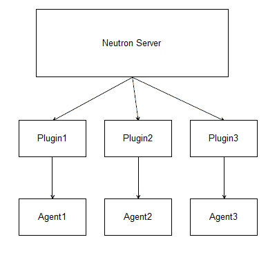

# neutron
该目录下包含了neutron实现的主要代码。
neutron从设计理念上来看，可以分为neutron-server相关（含各种plugin）和neutron-agent相关两大部分。
其中neutron-server维护high-level的抽象网络管理，并通过不同产品的plugin（这些plugin需要实现neutron定义的一系列操作网络的API）转化为各自agent能理解的指令，agent具体执行指令。简单的说，neutron-server是做决策的，各种neutron-agent是实际干活的，plugin是上下沟通的。如图表 1 所示。在这种结构中，同一时间只能有一套 plugin--agent 机制发生作用。

目前，ML2子项目希望统一plugin对上接口，通过提供不同的驱动，来沟通不同产品的实现机制。
